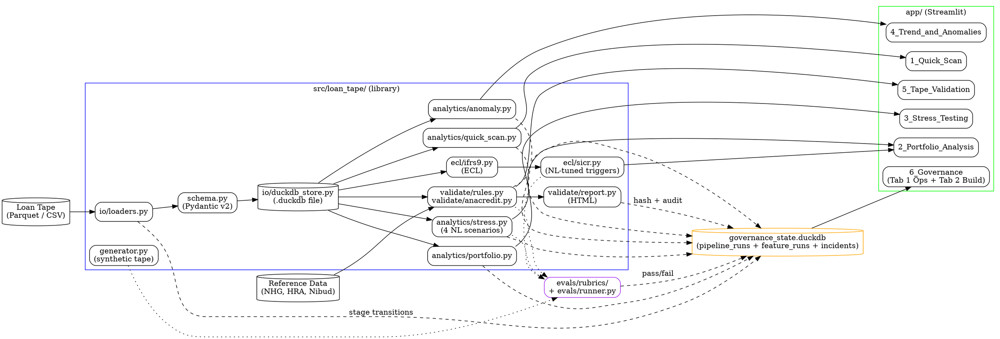

# Architecture

> One-page system view. Filled in with a real graphviz diagram during Day 3.
>
> **Scope.** This document covers the *internals* of the platform — components, data flow, trust boundaries. For *where the platform sits in the broader Dutch mortgage ecosystem* (upstream origination, downstream consumers, and the rationale for our slice), see [`scope-boundary.md`](scope-boundary.md).

## Component diagram (graphviz DOT)



To render: paste into `dot -Tpng` or upload to <https://dreampuf.github.io/GraphvizOnline/>.

## Data flow (sequence)

```
1. Analyst uploads tape via Streamlit (page 5).
2. loaders.py → Pydantic schema validation at boundary.
3. Tape persisted to DuckDB (single file under data/samples/).
4. validate/rules.py runs all cross-field rules → report.py → HTML.
5. analytics/* compute Quick Scan, Portfolio, Stress, Anomaly.
6. ecl/sicr.py determines IFRS 9 stage for each loan.
7. Pipeline stage transitions written to governance_state.duckdb.
8. Page 6 reads governance_state.duckdb → operations dashboard (Tab 1).
9. CI / GitHub Actions writes feature_runs entries → page 6 Tab 2.
10. Sign-off (Tab 1, 1st-line manual) → Publish (audit hash logged).
```

## Trust boundaries

- **External world** ↔ **Streamlit upload** — Pydantic schema enforces type/range at the boundary. No raw stack trace leaks back to user.
- **Library** ↔ **Governance state** — only writes through a typed wrapper; never raw DuckDB SQL from outside `io/`.
- **AI-authored code** ↔ **main branch** — PreCommit hooks + CI + 1st-line + 2nd-line (regulated paths only).

## Tech stack

Python 3.11 · uv · Polars + pandas fallback · DuckDB · Pydantic v2 · Streamlit · Plotly · scikit-learn · statsmodels · pytest + hypothesis · ruff · detect-secrets.

## See also

- `docs/domain-primer.md` — domain context behind the schema
- `docs/governance/fail-gracefully.md` — contracted failure behaviors per stage
- `docs/eu-ai-act-position.md` — trust boundary mapping to AI Act articles
