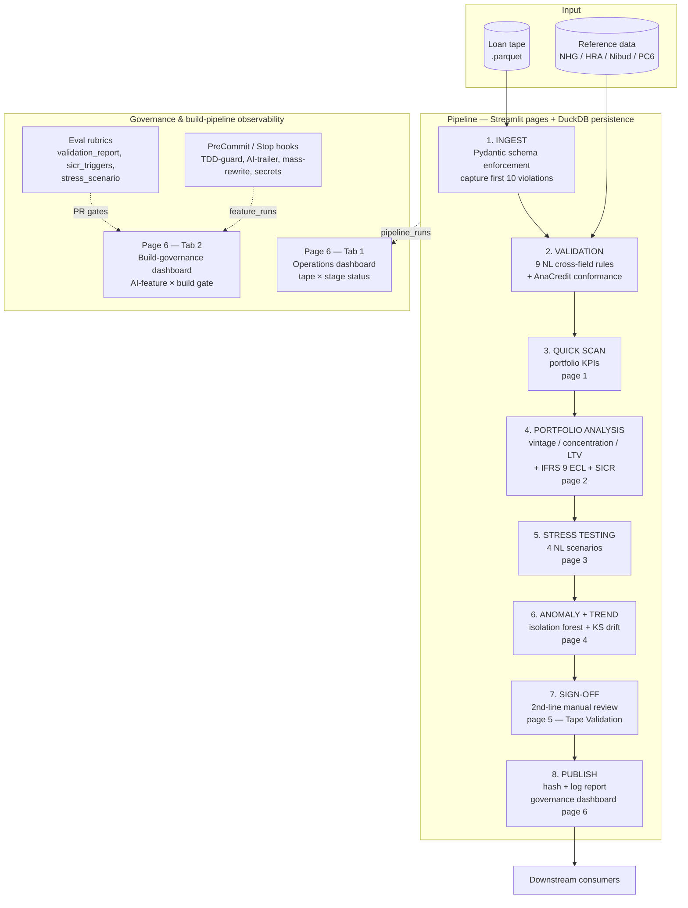

# Scope Boundary — Where This Platform Sits in the NL Mortgage Ecosystem

> **Purpose.** This document draws the line around what the *Dutch Synthetic Loan-Tape Analyzer* is and is not. It shows the full Netherlands mortgage lifecycle, the slice we build, what must happen before our work begins, what we expect as input, what we deliver, and what consumes our output. It also explains — explicitly — *why* we picked this slice and not the alternative.
>
> **Audience.** A reviewer who wants to know whether you understand the ecosystem before they assess whether you can build inside it. A Dutch credit-risk interviewer. A 2nd-line MRM reviewer auditing the platform's remit.
>
> **Status.** Authoritative scoping artifact. Updated whenever the input or output contract changes.

---

## 1. Executive summary

The Dutch residential-mortgage lifecycle spans **two distinct platforms** at two distinct points in the loan's life:

1. **Mortgage origination platform** — the customer-facing system that takes a borrower from "I want to buy a house" through notary signing. Outputs: a funded mortgage on the bank's books. **Not what we build.**
2. **Credit risk portfolio analytics platform** — the internal system that takes the *already-funded* book of mortgages and produces quick-scans, validations, stress tests, anomaly signals, and governance reporting. Outputs: insights for 1st-line credit risk, 2nd-line MRM, 3rd-line audit, the regulator, and the capital-planning team. **This is what we build.**

The two platforms share the same regulatory vocabulary (NHG, HRA, Nibud, *Tijdelijke regeling*, BCBS 239, EU AI Act, DORA) but operate on different objects, different stakeholders, different SLAs, and different failure modes. Confusing them is the most common scope error in this space; this document keeps us honest.

We picked the portfolio-analytics slice because the job description picked it. The JD reads: *"quick scans, portfolio analysis, scenario analysis, stress testing, trend and anomaly analysis, and validations on loan tapes / data requests."* Every phrase is portfolio-side. The platform is the *next step after origination*, not a replacement for it.

---

## 2. The full Dutch mortgage lifecycle (where we sit)

```mermaid
flowchart LR
    subgraph upstream["UPSTREAM — Mortgage origination platform (NOT IN SCOPE)"]
        direction LR
        S0[0. Case inception]
        S1[1. Affordability]
        S2[2. Mortgage strategy]
        S3[3. Property & offer]
        S4[4. Dossier assembly]
        S5[5. Underwriting & offer]
        S6[6. Closing & funding]
        S0 --> S1 --> S2 --> S3 --> S4 --> S5 --> S6
    end

    S6 ==>|funded loan lands on book| HANDOFF{{Loan-Tape Handoff}}

    subgraph ours["OUR PLATFORM — Credit risk portfolio analytics (IN SCOPE)"]
        direction LR
        P0[0. Loan-tape ingest]
        P1[1. Schema validation]
        P2[2. Cross-field rules + AnaCredit]
        P3[3. Quick scan]
        P4[4. Portfolio analysis + SICR]
        P5[5. Stress testing]
        P6[6. Anomaly + drift]
        P7[7. Sign-off + publish]
        P0 --> P1 --> P2 --> P3 --> P4 --> P5 --> P6 --> P7
    end

    HANDOFF ==> P0

    P7 ==>|reports + signals + governance state| downstream

    subgraph downstream["DOWNSTREAM CONSUMERS (NOT IN SCOPE)"]
        direction TB
        D1[Capital planning / RWA]
        D2[IFRS 9 ECL booking]
        D3[DNB / ECB reporting]
        D4[Internal Audit]
        D5[Strategy / pricing]
        D6[Risk appetite review]
    end
```

We build only the green middle slice. Every grey box is a real, separately-owned system — we know they exist, we know their contracts with us, but we do not build them in this artifact.

---

## 3. UPSTREAM — what must happen before our work begins

The **mortgage origination platform** is the customer-facing buyer-journey system. It is the source of every loan that lands on our tape. We do not build it, but we depend on it producing complete, correct loan records.

### 3.1 The seven origination stages

| Stage | Purpose | Data produced (and ultimately handed to us) |
|---|---|---|
| **0. Case inception** | Open case, capture consent, establish applicant identity | `borrower_id` candidate, consent record, KYC outcome |
| **1. Affordability** | Estimate borrowing capacity (Nibud / *Tijdelijke regeling* compliant) | Income model, debt model, derived `dscr`, `gross_household_income`, BKR check → `bkr_score_band` |
| **2. Mortgage strategy** | Choose product path with the adviser | `repayment_type`, `rate_type`, `rentevast` period, `tax_deduction_eligible` decision |
| **3. Property & offer** | Bind target property, financing clause, valuation order | `pc6`, `gemeente`, `property_type`, `bouwjaar`, `energy_label`, `taxatie_waarde`, `taxatie_type`, `taxatie_date`, `woz_waarde` |
| **4. Dossier assembly** | Collect verified evidence (passport, payslips, employer statement, marital status, tax returns, bank statements, etc.) | Verified document set — not directly on our tape, but the *audit trail* sits behind every field on it |
| **5. Underwriting & offer** | Submit to lender; bind PD/LGD/EAD; assign Basel risk weight; NHG decision | `pd_12m`, `pd_lifetime`, `lgd`, `ead`, `risk_weight`, `nhg_flag`, `nhg_cap_at_origination`, `nhg_premium_paid` |
| **6. Closing & funding** | Notary signs deed; funds disburse; loan goes live on the bank's book | `loan_id`, `origination_date`, `maturity_date`, `original_principal`, `interest_rate`, `current_balance` (= `original_principal` at t=0), `ifrs9_stage` = "1" (default for new performing loan) |

### 3.2 Origination handoff invariants (what we assume on arrival)

By the time a record reaches us, the origination platform must have produced:

- **A globally-unique `loan_id`** — primary key, stable across reporting periods.
- **A `borrower_id`** — same borrower across multiple loans (concentration risk depends on this).
- **All schema-required fields** populated — no nulls on regulated paths.
- **Pre-aggregated risk metrics** — PD/LGD/EAD already computed by the upstream model factory. We aggregate, stress, and validate; we do not score.
- **NHG decision finalized** — `nhg_flag` reflects WEW's actual underwriting decision, not a candidate state.
- **Consent and KYC complete** — GDPR/AVG hand off is upstream's responsibility; we receive a pseudonymous `borrower_id`.

These invariants are codified in `src/loan_tape/schema.py` as Pydantic constraints. Any record that violates them is rejected at our ingest boundary — that *is* our first contribution back upstream (a "loan tape with this loan is bad" signal).

---

## 4. The KICKOFF — what data we expect to start

Our work begins when a **loan tape** lands in `data/samples/` (or, in production, in the bank's data lake). The tape is a flat columnar file (Parquet preferred, CSV accepted) with one row per loan.

### 4.1 Input contract (loan-tape columns we require)

The full contract is the `Loan` Pydantic schema in `src/loan_tape/schema.py`. Summarized:

| Domain | Required fields (sample) | Source upstream stage |
|---|---|---|
| **Identity** | `loan_id`, `borrower_id`, `borrower_type` | Stage 0 |
| **Contract** | `origination_date`, `maturity_date`, `original_principal`, `current_balance`, `interest_rate`, `rate_type`, `rentevast_einddatum`, `repayment_type`, `tax_deduction_eligible`, `hra_phase_out_rate`, `interest_only_portion`, `currency` (EUR) | Stages 2, 6 |
| **Collateral** | `property_value_at_origination`, `taxatie_waarde`, `taxatie_date`, `taxatie_type`, `woz_waarde`, `property_value_current`, `pc6`, `gemeente`, `property_type`, `bouwjaar`, `energy_label`, `nhg_flag`, `nhg_cap_at_origination`, `nhg_premium_paid` | Stage 3 |
| **Credit-risk** | `pd_12m`, `pd_lifetime`, `lgd`, `ead`, `ifrs9_stage`, `sicr_trigger_reason`, `days_past_due`, `arrears_bucket`, `restructured_flag`, `risk_weight`, `unlikely_to_pay_flag` | Stage 5 + ongoing book-keeping |
| **Affordability** | `gross_household_income`, `partner_income_included`, `student_loan_debt`, `bkr_score_band`, `bkr_negative_registration_flag`, `dscr` | Stage 1 |

All in all: ~45 fields. The schema in code is the source of truth; this table is the human-readable summary.

### 4.2 What we do NOT need from upstream

We deliberately do **not** require:

- Raw documents (payslips, employer statements, marital-status certificates, passport scans). Those are dossier-assembly's job; we trust the verified outcome only.
- Free-text adviser notes. We don't model the customer journey.
- Real-time lifecycle events (the offer was accepted at 14:32). We work on dated snapshots.
- PII. The tape ships with `borrower_id` as a pseudonymous key — GDPR/AVG-relevant PII stays in the origination system's vault.

This minimal-input stance is what lets the platform pass a bank security review without a DPIA, and it's why the README pins "synthetic data only — GDPR-clear" as the disclaimer.

### 4.3 Real-world data sources behind a production tape

In a real Dutch bank, a production tape is assembled by Data Engineering from:

- **Core banking system** — current balance, arrears, dpd, stage.
- **Mortgage servicing system** — `repayment_type`, `interest_rate`, `rentevast_einddatum`, payment schedule.
- **Risk data store** — `pd_12m`, `pd_lifetime`, `lgd`, `ead`, `risk_weight` (output of the model factory).
- **Collateral data store** — `property_value_current`, `taxatie_*`, `woz_*`, `energy_label`.
- **WEW feed** — NHG state.
- **CBS / Kadaster** — geo enrichment.
- **BKR** — negative registration flags.

In this synthetic project, all of that is replaced by `src/loan_tape/generator.py` — a deterministic NL-realistic generator producing a tape that is statistically and structurally indistinguishable from the real thing, with no PII concerns.

---

## 5. OUR SLICE — what we actually build

Our platform is an **8-stage data pipeline** plus a **governance dashboard** that observes both the pipeline *and* the AI-assisted build process. Per `docs/governance/fail-gracefully.md` §7.7.1, every stage has a named failure mode and a contracted graceful behavior.

### 5.1 The eight pipeline stages

| Stage | What runs | Owner line | Fail-gracefully behavior |
|---|---|---|---|
| **1. Ingest** | Schema parse + Pydantic validation at boundary | 1st | File missing → FAILED + file hash; schema drift → capture first 10 violations |
| **2. Validation** | 9 NL cross-field rules + AnaCredit conformance check | 1st | >1% critical → BLOCKED needs override; AnaCredit null → WARNING blocks Publish |
| **3. Quick Scan** | KPIs (exposure, weighted PD/LTV, stage mix, NHG share, etc.) | 1st | NaN/Inf → stage FAILED; never silent "0.0" |
| **4. Portfolio analysis + SICR** | Vintage × arrears, concentration, LTV waterfall, IFRS 9 stage transitions | 1st | Empty cohort → "no data" panel, never crash |
| **5. Stress testing** | 4 NL scenarios: DNB HPI, HRA phase-out, rentevast reset, energy-label transition | 1st | Out-of-band delta → FAILED requires 2nd-line review |
| **6. Anomaly + trend** | Isolation forest on per-loan features + KS-test drift | 1st | IF fails to converge → fall back to rule-based, log degraded_mode |
| **7. Sign-off** | 2nd-line manual review with comment captured | 2nd | SLA breach → auto-escalate, never auto-approve |
| **8. Publish** | HTML report rendered, hashed, logged to audit DB | 1st | DuckDB write fail → retry + freeze, no partial report |

### 5.2 The governance overlay (page 6)

**Tab 1 — Operations (1st-line view)**: every tape's progress through the 8 stages, with drill-in to timestamps, eval results, approver, report hash.

**Tab 2 — Build governance (2nd-line view)**: every AI-assisted *feature*'s progress through 8 build gates (planned → Claude-implemented → tests green → evals green → 1st-line review → 2nd-line review → merged → deployed). Reads from git log (AI-authorship trailer), CI runs, eval results.

Both tabs persist to `governance_state.duckdb`. This is what makes the platform *self-governing*: it doesn't just analyse loans, it auditably tracks how it was built and how it ran. That governance overlay is the most distinguishing artifact in the whole repo.

### 5.3 What we do NOT build (even within the analytics scope)

To stay focused, we deliberately exclude these features that a credit-risk team might ask for next:

- **PD/LGD model development.** Model factory work — out of scope (Annex III §5(b) high-risk).
- **Pricing tools.** Risk-based pricing recommendations are a separate platform.
- **Origination decisioning support.** Adviser-facing tools — that's the upstream platform.
- **Customer-facing dashboards.** Borrowers do not see this tool.
- **Loan servicing operations.** Payment processing, arrears collection, hardship workflows — those are core banking, not analytics.
- **Real-time event processing.** We work on dated snapshots, not the event bus.

---

## 6. DOWNSTREAM — what consumes our output

Our `Publish` stage produces three artifacts that downstream systems and stakeholders consume:

### 6.1 Output 1 — HTML validation report

A complete `docs/sample-reports/<tape>-<date>.html` (renderer in `src/loan_tape/validate/report.py`) covering:

- Per-rule findings grouped by severity (CRITICAL / HIGH / MEDIUM / LOW)
- BCBS 239 dimension grouping (accuracy / completeness / timeliness / integrity)
- AnaCredit conformance share
- Every CRITICAL finding cites the source regulation

**Consumers:**
- Data quality team (1st line) — fix data issues at source.
- 2nd-line MRM — review for regulatory breaches before sign-off.
- Internal Audit (3rd line) — periodic data-quality assurance.

### 6.2 Output 2 — Structured analytics + signals

Polars DataFrames and DuckDB tables feeding:

- **Quick-scan KPIs** → Risk Committee weekly pack.
- **Portfolio analysis** (vintage, concentration, LTV, *rentevast* cohort) → Credit Risk team's monthly portfolio review.
- **Stress test results** → Capital planning / ICAAP / ECB stress-test submission.
- **Anomaly signals** → Investigation queue for 1st line.
- **IFRS 9 stage transitions + SICR triggers** → IFRS 9 ECL booking (Finance team).
- **AnaCredit attribute table** → ECB reporting pipeline (via `validate/anacredit.py::map_tape`).

### 6.3 Output 3 — Governance audit trail

The `governance_state.duckdb` accumulates:

- `pipeline_runs` — every tape's stage-by-stage timeline + outcomes + approver + report hash.
- `feature_runs` — every AI-assisted feature's progression through 8 build gates with reviewers, eval deltas, EU AI Act articles touched.
- `incidents` — structured incident records when a stage hits `FAILED`.

**Consumers:**
- DNB / ECB auditors during model-risk review.
- Internal Audit during 3rd-line periodic assurance.
- The bank's Responsible AI / EU AI Act conformance team.

### 6.4 What we explicitly do NOT do post-Publish

- **Send anything to the borrower.** No customer-facing output.
- **Write to core banking systems.** Our outputs are advisory; capital booking happens in Finance's system based on our numbers, not by direct API write.
- **Auto-update PD/LGD models.** Model retraining triggers exist but are owned by the model factory, not by us. We *signal* drift; we don't *fix* it.
- **Auto-approve anything.** Sign-off is always a 2nd-line human action.

---

## 7. WHY we picked this limited slice

The full Dutch mortgage lifecycle has two natural platforms: origination (customer-facing) and portfolio analytics (internal-facing). We chose to build only the second. Here is the reasoning explicitly.

### 7.1 The role asks for it

The JD is unambiguous. Reread the key sentence:

> *"quick scans, portfolio analysis, scenario analysis, stress testing, trend and anomaly analysis, and validations on loan tapes / data requests."*

Every noun is a portfolio-analytics noun. *"Loan tape"* = a snapshot of the existing book. *"Stress testing"* = applying a macro shock to existing exposures. *"Validations on data requests"* = checking that an ad-hoc data extract is internally consistent. None of this is origination work; the JD never mentions customer journeys, advisers, appraisers, notaries, or fund disbursement.

**Building the origination journey instead would be answering a question they didn't ask.** A Dutch interviewer would notice immediately.

### 7.2 The credibility math

A portfolio analytics platform is a *narrower* artifact than an origination platform, which means a single builder can take it from MVP to production-credible in a focused weekend. The depth signal — *"this is real, not a demo"* — comes from doing one thing well, not from covering everything shallowly. The origination journey has 7 stages × multiple agents × document OCR × lender adapters × notary integrations: it is a several-engineer-quarters build, not a portfolio piece.

The harness, the eval suite, the fail-gracefully playbook, the Three Lines of Defense governance, the EU AI Act position — those are what make this artifact win interviews. They are equally applicable to either platform, but they only land *credibly* if the underlying system is genuinely complete.

### 7.3 The regulatory frame favors the slice

The portfolio-analytics slice is **out of EU AI Act Annex III §5(b) scope** (we don't score natural persons). The origination slice is **inside it** — any "advice → product recommendation → strategy approval" step is creditworthiness-relevant, which makes it a high-risk AI system with Articles 9/10/13/14/15 fully binding on the platform itself, not just voluntarily. That's a different governance build, with different paperwork.

Picking the portfolio slice lets us *demonstrate* AI Act-aligned discipline (we voluntarily map every Article to a concrete control) without committing to *high-risk-system-level* documentation that no portfolio piece can credibly produce.

### 7.4 The shared vocabulary makes the slice defensible

The portfolio and origination platforms share:

- **Regulatory anchors**: IFRS 9, EBA SICR, Basel CRR III, BCBS 239, AnaCredit, NHG/WEW, *Tijdelijke regeling*, Nibud, EU AI Act, DORA.
- **Domain vocabulary**: PD, LGD, EAD, *rentevast*, *aflossingsvrij*, *hypotheekrenteaftrek*, energy label, WOZ vs *taxatie*, BKR, NHG cap.
- **Failure-mode patterns**: missing evidence, contested fields, SLA breach, human-in-the-loop gates.

Because the platforms share vocabulary, **mastering the portfolio side prepares you for origination conversations at the interview** — but the demo artifact you walk in with stays scoped and credible.

### 7.5 Hand-off contracts are the safety valve

The doc you are reading right now is the safety valve. It says, in concrete terms, what we expect from upstream and what we deliver downstream. A reviewer who asks *"but what about case inception?"* gets a clean answer: *"That's the origination platform — here is the data contract between us, here is the V2 roadmap if we ever wanted to extend, here is why we chose not to extend now."*

That answer is itself a credibility signal.

---

## 8. Risk register — what could go wrong with this scoping choice

| Risk | Likelihood | Impact | Mitigation |
|---|---|---|---|
| Reviewer thinks we "missed" the customer journey | Medium | High | This doc — explicit boundary statement at `docs/scope-boundary.md`, referenced from README. |
| Reviewer thinks the demo is too narrow | Low | Medium | Eight pipeline stages × governance dashboard × eval suite × 9 validation rules + 6 SICR triggers + 4 stress scenarios — narrow in scope, deep in coverage. |
| Reviewer asks why we don't have lender adapters | Low | Low | Lender adapters are origination-side. We consume lender output as already-priced PD/LGD/EAD on the tape. |
| Reviewer assumes we can score creditworthiness | Medium | High | EU AI Act position doc + every Streamlit page's About/Limits panel state explicitly: *"not a creditworthiness scoring system for natural persons."* |
| V2 extension to origination is mis-estimated | Low | Medium | §9 below makes the V2 cost honest. |

---

## 9. V2 roadmap — what extending into origination would mean

Not building. Just acknowledging. If a future engagement asked us to extend into origination:

**Effort estimate.** Roughly 3× the current build. Reasons:

- **Stateful per-case orchestration** — every case is a long-running stateful entity (weeks to months), not a stateless analytical pass over a tape. Requires a case graph + event log + reliable workflow engine.
- **Document handling** — OCR, classification, extraction, confidence scoring, translation (NL/EN). The MVP fully replaces document evidence with synthetic flags; real origination cannot.
- **Lender adapters** — one per lender, with versioned API contracts and submission pack formats.
- **Notary + appraiser integrations** — appointment sync, deed-checklist validation, fund-release coordination.
- **Real-time event processing** — financing-clause deadlines, time-sensitive offer windows.
- **EU AI Act Annex III §5(b) compliance** — the platform becomes a *high-risk AI system*, requiring formal conformity assessment, technical documentation, post-market monitoring per Article 72, and CE marking.

**What of the current build would survive.** All of it, as a *reference data store* and *eligibility / affordability calculator* for the new platform — IFRS 9 stage logic, SICR triggers, NHG cap lookup, HRA eligibility, validation rules. The shared library `src/loan_tape/` is still the source of truth for Dutch-mortgage domain logic.

**What of the current build would not be enough.** The Streamlit UI (origination needs a multi-stakeholder workflow tool, not a dashboard). The governance dashboard (would need to extend to per-case lifecycle, not per-tape pipeline). The eval suite (would need to grow to cover OCR confidence, classification accuracy, lender-response-parsing correctness).

This is roadmap, not commitment.

---

## 10. The 30-second elevator pitch for an interviewer

> *"I built a Dutch mortgage credit-risk portfolio analytics platform — the post-origination analytical tool a Credit Risk team uses to validate, scan, stress, and surface anomalies on the existing book. I deliberately did not build the origination journey, because that is a separately-owned customer-facing platform with different stakeholders, different SLAs, and Annex III high-risk AI Act obligations. The scope-boundary doc spells out exactly where I sit, what I expect from upstream, what I deliver downstream, and why I picked this slice. That's the role you posted, built end-to-end with Claude, with a governance overlay that makes it auditable by a 2nd-line reviewer."*

That paragraph is what you say first in the interview.

---

## Appendix A — Doc cross-references

| When the reviewer asks… | Point them at… |
|---|---|
| What's the input schema in detail? | `src/loan_tape/schema.py` and `docs/domain-primer.md` |
| What governance applies? | `docs/governance/three-lines-of-defense.md`, `docs/governance/raci.md`, `docs/governance/change-management.md` |
| How do you fail safely? | `docs/governance/fail-gracefully.md` (both pipeline + build-pipeline tables) |
| EU AI Act scoping? | `docs/eu-ai-act-position.md` |
| Why these regulations? | `docs/regulation-map.md` |
| What about AnaCredit? | `docs/appendix/anacredit-mapping.md` |
| How does this fit the broader NL mortgage workflow? | **This doc** |
